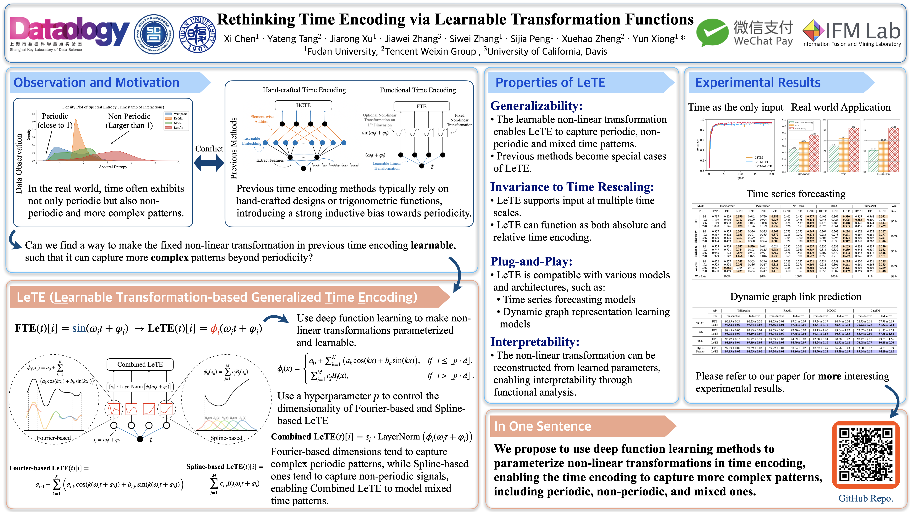

# LeTE 
[](https://icml.cc/virtual/2025/poster/43983)&nbsp;
[](https://arxiv.org/abs/2505.00887)&nbsp; 

**LeTE: Learnable Transformation-based Generalized Time Encoding**

Code for the paper **"Rethinking Time Encoding via Learnable Transformation Functions"**

🔥Our paper has been accepted by [ICML](https://icml.cc/virtual/2025/poster/43983) 2025.

You can also find the paper at [arXiv](https://arxiv.org/pdf/2505.00887).


## Demo Experiments

You can run the demo experiments in the EventBasedMNIST.ipynb.

This notebook is corresponding to the experiments in the paper Section 4.1 Time as the Only Input.

## Citation

```bibtext
@misc{chen2025lete,
      title={Rethinking Time Encoding via Learnable Transformation Functions}, 
      author={Xi Chen and Yateng Tang and Jiarong Xu and Jiawei Zhang and Siwei Zhang and Sijia Peng and Xuehao Zheng and Yun Xiong},
      year={2025},
      eprint={2505.00887},
      archivePrefix={arXiv},
      primaryClass={cs.LG},
      url={https://arxiv.org/abs/2505.00887}, 
}
```

## Poster

